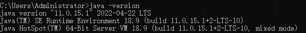
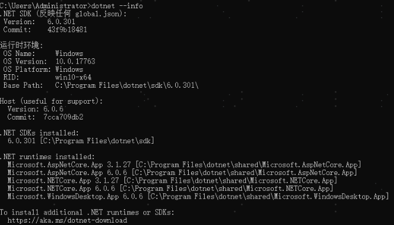

**参考执行：[.net5基于Jenkins+Gitee的自动发布](https://blog.csdn.net/huangwp2000/article/details/112858525)**

注意点：

1. 安装Nuget(可以不安装)、安装Git、安装JDK
2. 安装.net core程序（编译时需要）
3. 执行dotnet编译时警告（设置忽略）

```
dotnet build D:\Web\jenkins\workspace\Forum -nowarn:CS1591,CS8618,CS8625,CS8604,CS8603,CS8602,CS8601 --configuration Release
 
dotnet publish -o D:\Web\jenkins\release\Forum -nowarn:CS1591,CS8618,CS8625,CS8604,CS8603,CS8602,CS8601

```

忽略所有的警告
```
dotnet build /p:WarningLevel=0
````

4. 配置文件可能存在服务器和代码中不相同的情况，可以先把配置文件放到一个文件夹，构建完成后再copy到程序文件中

```
del D:\WebSite\EWM_Api\web.config /s /q
del D:\WebSite\EWM_Api\appsettings.json /s /q

copy D:\WebSite\Config\EWMAPI\appsettings.json D:\WebSite\EWM_Api\appsettings.json
copy D:\WebSite\Config\EWMAPI\web.config D:\WebSite\EWM_Api\web.config
```

5. Jenkins安装插件失败时，检查是否可以外网。

查看jdk版本


查看dotnet信息
