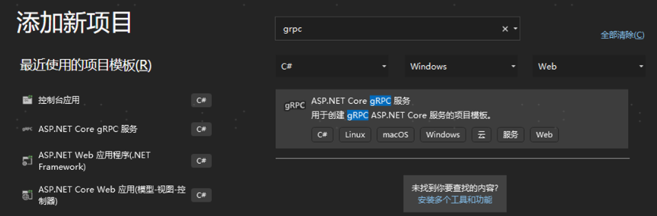
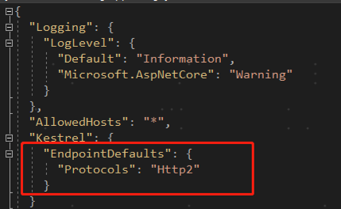
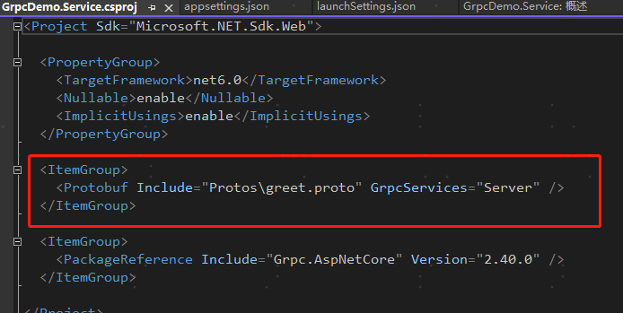
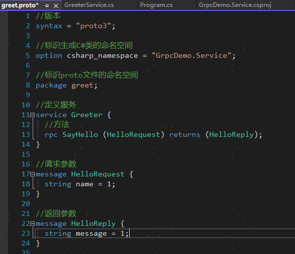
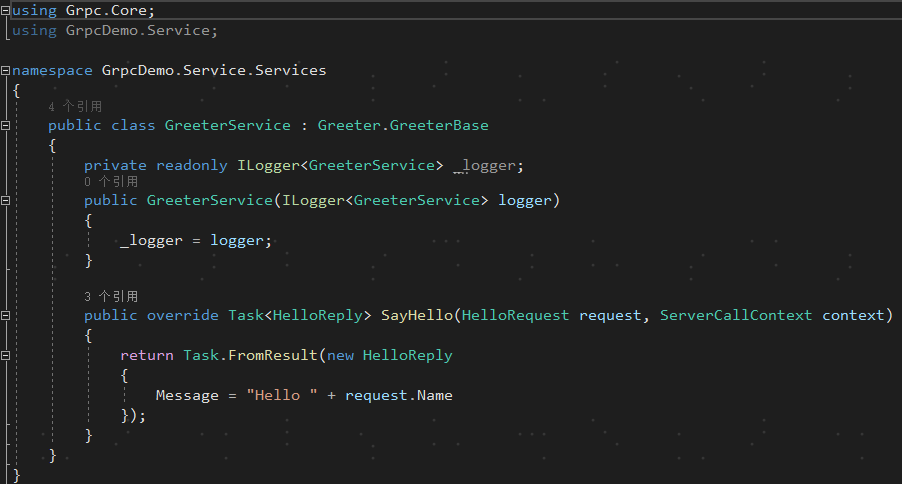
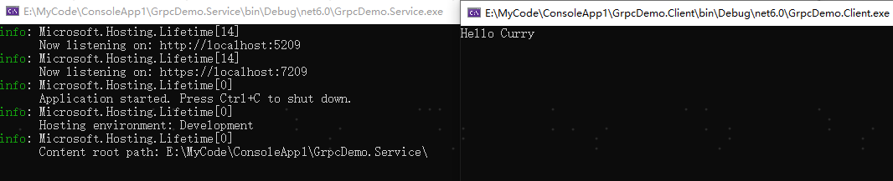
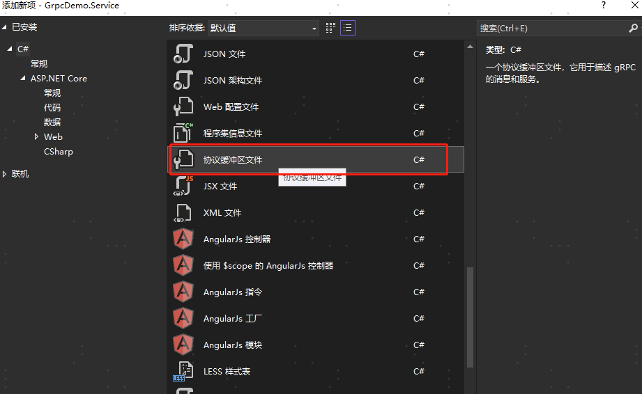
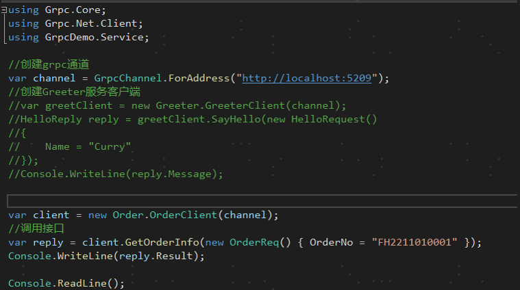
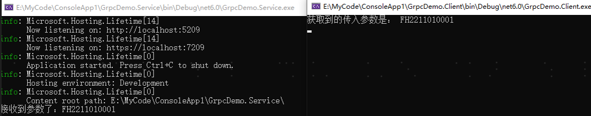

## GRPC
gRPC 是一个由Google开源的，跨语言的，高性能的远程过程调用（RPC）框架。 gRPC使客户端和服务端应用程序可以透明地进行通信，并简化了连接系统的构建。它使用HTTP/2作为通信协议，使用 Protocol Buffers 作为序列化协议。

#### gRPC 的优势
gRPC 使用 HTTP/2 作为传输协议。 虽然与 HTTP 1.1 也能兼容，但 HTTP/2 具有许多高级功能：
- 用于数据传输的二进制组帧协议 - 与 HTTP 1.1 不同，HTTP 1.1 是基于文本的。
- 对通过同一连接发送多个并行请求的多路复用支持 - HTTP 1.1 将处理限制为一次处理一个请求/响应消息。
- 双向全双工通信，用于同时发送客户端请求和服务器响应。
- 内置流式处理，支持对大型数据集进行异步流式处理的请求和响应。
- 减少网络使用率的标头压缩。

gRPC 是轻量型且高性能的。 其处理速度可以比 JSON 序列化快 8 倍，消息小 60% 到 80%。 在WCF中，gRPC 的性能超过经过高度优化的 NetTCP 绑定的速度和效率。 与偏向于 Microsoft 堆栈的 NetTCP 不同，gRPC 是跨平台的。

#### 四种通信模式及其使用场景

| 服务类型 |特点  | 
| --- | --- | 
| 简单RPC | 一般的rpc调用，传入一个请求对象，返回一个返回对象 |  
| 服务端流式RPC | 传入一个请求对象，服务端可以返回多个结果对象 |  
| 客户端流式RPC | 客户端传入多个请求对象，服务端返回一个结果对象 |  
| 双向流式RPC | 结合客户端流式RPC和服务端流式RPC，可以传入多个请求对象，返回多个结果对象 |  

#### Unary PRC
```
 rpc UnaryCall (ExampleRequest) returns (ExampleResponse);
```
客户端发起一次请求，服务端响应一个数据，即标准RPC通信。
这种模式，一个每一次都是发起一个独立的tcp连接，走一次三次握手和四次挥手！

#### Server streaming RPC
```
rpc StreamingFromServer (ExampleRequest) returns (stream ExampleResponse);
```
服务端流 RPC 下，客户端发出一个请求，但不会立即得到一个响应，而是在服务端与客户端之间建立一个单向的流，服务端可以随时向流中写入多个响应消息，最后主动关闭流，而客户端需要监听这个流，不断获取响应直到流关闭

**应用场景举例：**
典型的例子是客户端向服务端发送一个股票代码，服务端就把该股票的实时数据源源不断的返回给客户端。

#### Client streaming RPC
```
rpc StreamingFromClient (stream ExampleRequest) returns (ExampleResponse);
```
**应用场景：**
物联网终端向服务器报送数据。

#### Bi-directional streaming RPC
```
rpc GetOrderNO(stream  OrderRequest) returns ( stream OrderReply);
```
**应用场景：**
聊天应用。

## GRPC示例
#### 新建GRPC项目，GrpcDemo.Service


创建完成后，看下项目中的代码
1. 配置文件appsettings.json多了Kestrel启用 HTTP/2 的配置，因为 gRPC 是基于HTTP/2来通信的

2. csproj中增加了包含Protobuf



后面如果需要新增proto，需要手动添加，这边一次性改成通配符
```
<Protobuf Include="Protos\*.proto" GrpcServices="Server" />
```
3. Program中将gRPC服务添加到了终结点路由中
```
app.MapGrpcService<GreeterService>();
```
4. 查看PB协议文件greet.proto

5. 服务类GreeterService，服务类集成的Greeter.GreeterBase


#### 创建gRPC客户端
添加包Google.Protobuf、Grpc.Net.Client、Grpc.Tools


项目文件中添加GrpcDemo.Service的proto文件
```
<Protobuf Include="..\GrpcDemo.Service\Protos\*.proto" GrpcServices="Client" 
Link="Protos\%(RecursiveDir)%(Filename)%(Extension)" />
```
Program中调用服务
```
using Grpc.Core;
using Grpc.Net.Client;
using GrpcDemo.Service;

//创建grpc通道
var channel = GrpcChannel.ForAddress("http://localhost:5274");

//创建Greeter服务客户端
var greetClient = new Greeter.GreeterClient(channel);
HelloReply reply = greetClient.SayHello(new HelloRequest()
{
    Name = "Curry"
});
Console.WriteLine(reply.Message);
Console.ReadLine();
```
运行程序，测试

Client发起了HTTP/2 POST请求，服务端返回了Hello Curry。

## 新增Proto文件
新增PB协议文件

由于我们已经处理过项目文件，此处不需要过多处理，直接修改文件
```
syntax = "proto3";
option csharp_namespace = "GrpcDemo.Service";

//标识proto文件的命名空间
package order;

//定义服务
service Order {
  //发送
  rpc GetOrderInfo (OrderReq) returns (OrderResp);
}

message OrderReq{
	string OrderNo=1;
}

message OrderResp{
	string Result=1;
}
```
生成解决方案后，新增Service
```
using Grpc.Core;
using GrpcDemo.Service;

namespace GrpcDemo.Service.Services
{
    public class OrderService : Order.OrderBase
    {
        private readonly ILogger<OrderService> _logger;
        public OrderService(ILogger<OrderService> logger)
        {
            _logger = logger;
        }

        public override Task<OrderResp> GetOrderInfo(OrderReq request, ServerCallContext context)
        {
            Console.WriteLine($"接收到参数了：{request.OrderNo}");
            return Task.FromResult(new OrderResp
            {
                Result = "获取到的传入参数是： " + request.OrderNo
            });
        }
    }
}
```
program中将服务增加到路由
```
app.MapGrpcService<OrderService>();
```

客户端调用测试

调用完成，测试正常


## 服务流、客户流和双向流的使用
```
//定义服务
service Greeter {
  //一元
  rpc UnaryCall (ExampleRequest) returns (ExampleResponse);
  //服务流
  rpc StreamingFromServer (ExampleRequest) returns (stream ExampleResponse);
  //客户流
  rpc StreamingFromClient (stream ExampleRequest) returns (ExampleResponse);
  //双向流
  rpc GetOrderNO(stream  ExampleRequest) returns ( stream ExampleResponse);
}

message ExampleRequest {
    int32 pageIndex = 1;
    int32 pageSize = 2;
}

message ExampleResponse{
    string result=1;
}
```
具体方法实现
```
//服务流
public override async Task StreamingFromServer(ExampleRequest request, IServerStreamWriter<ExampleResponse> responseStream, ServerCallContext context)
{
    int i = 0;
    while (!context.CancellationToken.IsCancellationRequested)
    {
        i++;
        await responseStream.WriteAsync(new ExampleResponse()
        {
            Result = "现在的数值是：" + i
        });
        await Task.Delay(TimeSpan.FromSeconds(1), context.CancellationToken);
    }
}

//客户流
public override async Task<ExampleResponse> StreamingFromClient(IAsyncStreamReader<ExampleRequest> requestStream, ServerCallContext context)
{
    int result = 0;
    while (await requestStream.MoveNext())
    {
        result += requestStream.Current.PageSize * requestStream.Current.PageIndex;
    }
    return await Task.FromResult(new ExampleResponse() { Result = result.ToString() });
}

//双向流
public override async Task StreamingBothWays(IAsyncStreamReader<ExampleRequest> requestStream, IServerStreamWriter<ExampleResponse> responseStream, ServerCallContext context)
{
    while (!context.CancellationToken.IsCancellationRequested && await requestStream.MoveNext())
    {
        int index = requestStream.Current.PageIndex;
        int size = requestStream.Current.PageSize;
        Console.WriteLine($"传入参数，PageIndex：{index}，PageSize：{size}");
        if (!context.CancellationToken.IsCancellationRequested)
        {
            await responseStream.WriteAsync(new ExampleResponse()
            {
                Result = $"index*size={index * size}"
            });
        }
    }
}
```
客户端调用
```
//服务流
async static Task StreamingFromServerTest()
{
    var channel = GrpcChannel.ForAddress(ServiceAddress);
    //创建Greeter服务客户端
    var greetClient = new Greeter.GreeterClient(channel);

    var result = greetClient.StreamingFromServer(new ExampleRequest()
    {
        PageIndex = 1,
        PageSize = 10
    });
    var cts = new CancellationTokenSource();

    var iter = result.ResponseStream; // 拿到响应流
    int num = 0;
    try
    {
        while (await iter.MoveNext(cts.Token)) // 迭代
        {
            num++;
            Console.WriteLine(iter.Current.Result);  // 将数据写入到文件流中
            if (num >= 5)
            {
                cts.Cancel();//调用5次后自动取消
            }
        }
    }
    catch (RpcException ex) when (ex.StatusCode == StatusCode.Cancelled)
    {
        Console.WriteLine("Stream cancelled.");
    }

    //输出返回结果
    Console.WriteLine("OK");
}

//客户流
async static Task StreamingFromClientTest()
{
    //创建Grpc通道
    var channel = GrpcChannel.ForAddress(ServiceAddress);
    //创建Greeter客户端
    var client = new Greeter.GreeterClient(channel);
    //创建客户流对象
    var clientStream = client.StreamingFromClient();
    for (var i = 1; i < 10; i++)
    {
        await clientStream.RequestStream.WriteAsync(new ExampleRequest() { PageIndex = i, PageSize = 10 });
    }
    await clientStream.RequestStream.CompleteAsync();
    var resut = await clientStream;
    Console.WriteLine($"客户端流请求结果{resut.Result}");
}

//双向流
async static Task StreamingBothWaysTest()
{
    //创建Grpc通道
    var channel = GrpcChannel.ForAddress(ServiceAddress);
    //创建Greeter客户端
    var client = new Greeter.GreeterClient(channel);
    //创建双向流对象
    var GetOrderNO = client.StreamingBothWays();
    //CancellationTokenSource 管理是否关闭流
    //CancellationTokenSource.CancelAfter() 规定时间关闭流
    //CancellationTokenSource.Cancel() 立即关闭流
    var cts = new CancellationTokenSource();
    //响应事件
    var backTask = Task.Run(async () =>
    {
        int current = 0;
        try
        {
            //从响应流获取数据(cts.Token: 是否关闭流)
            while (await GetOrderNO.ResponseStream.MoveNext(cts.Token))
            {
                current++;
                var back = GetOrderNO.ResponseStream.Current;
                Console.WriteLine($"{back.Result},加载进度{((double)current / count) * 100}%");
                if (current >= 5)
                {
                    cts.Cancel();
                }
            }
        }
        catch (RpcException ex) when (ex.StatusCode == StatusCode.Cancelled)
        {
            Console.WriteLine("Stream cancelled.");
        }
    });

    for (int i = 0; i < count; i++)
    {
        await GetOrderNO.RequestStream.WriteAsync(new ExampleRequest()
        {
            PageIndex = i,
            PageSize = 10
        });
    }

    //等待发送完成
    await GetOrderNO.RequestStream.CompleteAsync();

    Console.WriteLine("等待加载...");

    //等待响应完成
    await backTask;

    Console.WriteLine("已全部加载完毕");
}
```


