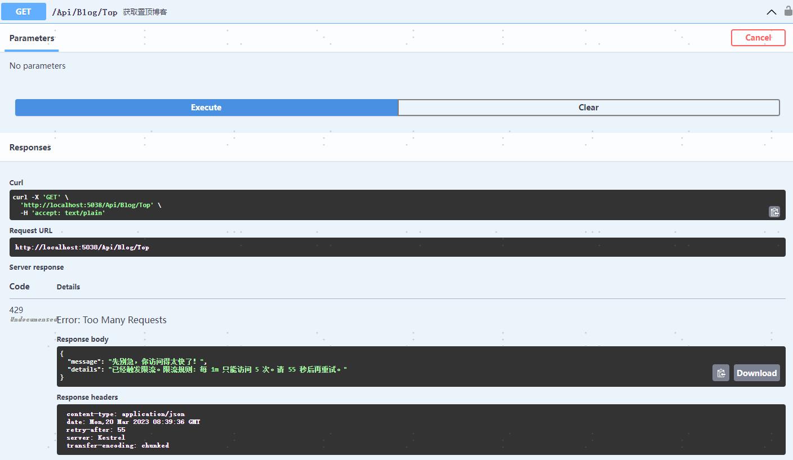

### 前言：对外接口要做限流，避免被暴力访问。.Net7内置了限流中间件，之前的系统如何操作呢？

使用开源框架：AspNetCoreRateLimit

项目地址: https://github.com/stefanprodan/AspNetCoreRateLimit

首先它有两种模式：
1. 根据IP地址限流
2. 根据 ClientID 限流

示例代码使用的是根据MemoryCache针对IP地址进行限流，具体步骤如下：

安装包：AspNetCoreRateLimit

注册服务
```
builder.Services.AddMemoryCache();
builder.Services.Configure<IpRateLimitOptions>(builder.Configuration.GetSection("IpRateLimiting"));
builder.Services.Configure<IpRateLimitPolicies>(builder.Configuration.GetSection("IpRateLimitPolicies"));
builder.Services.AddSingleton<IIpPolicyStore, MemoryCacheIpPolicyStore>();
builder.Services.AddSingleton<IRateLimitCounterStore, MemoryCacheRateLimitCounterStore>();
builder.Services.AddSingleton<IRateLimitConfiguration, RateLimitConfiguration>();
builder.Services.AddSingleton<IProcessingStrategy, AsyncKeyLockProcessingStrategy>();
```
添加中间件
```
app.UseIpRateLimiting();
```
> UseRateLimit 放在 UseStaticFiles等后面，避免请求静态文件等也进行限流

添加配置文件
```
"IpRateLimiting": {
    "EnableEndpointRateLimiting": true,
    "StackBlockedRequests": false,
    "RealIpHeader": "X-Real-IP",
    "ClientIdHeader": "X-ClientId",
    "HttpStatusCode": 429,
    //白名单
    "IpWhitelist": [],
    "EndpointWhitelist": [
      "get:/api/license",
      "*:/api/status"
    ],
    "ClientWhitelist": [
      "dev-id-1",
      "dev-id-2"
    ],
    "GeneralRules": [
      {
        "Endpoint": "*:/Api/Blog/Top",
        "Period": "1m",
        "Limit": 5
      }
    ],
    "QuotaExceededResponse": {
      "Content": "{{ \"message\": \"先别急，你访问得太快了！\", \"details\": \"已经触发限流。限流规则: 每 {1} 只能访问 {0} 次。请 {2} 秒后再重试。\" }}",
      "ContentType": "application/json",
      "StatusCode": 429
    }
  },
  "IpRateLimitPolicies": {
    "IpRules": [
      {
        "Ip": "192.168.1.1",
        "Rules": [
          {
            "Endpoint": "*",
            "Period": "1s",
            "Limit": 1
          }
        ]
      }
    ],
    "ClientRules": []
  }
```
配置文件解释
1. EnableEndpointRateLimiting：设置为true，否则设置的限流是全局的，不能根据某个路径单独设置限流
2. StackBlockedRequests：设置为false，若设置为true，则一个接口被限流之后再重复请求还会计算到访问次数里面
3. Endpoint：设置格式为**HTTP方法:路径**，如： "get:/Api/Blog/Top"
4. QuotaExceededResponse：返回值设置
5. IpRateLimitPolicies：对单独的IP进行特定的设置

运行测试，效果图：


> 若使用Redis，添加包AspNetCoreRateLimit.Redis，注册服务修改成：
```
services.Configure<IpRateLimitOptions>(conf.GetSection("IpRateLimiting"));
var redisOptions = ConfigurationOptions.Parse(SecretConfig.RedisConnectionString);
services.AddSingleton<IConnectionMultiplexer>(provider => ConnectionMultiplexer.Connect(redisOptions));
services.AddRedisRateLimiting();
services.AddSingleton<IRateLimitConfiguration, RateLimitConfiguration>();
```